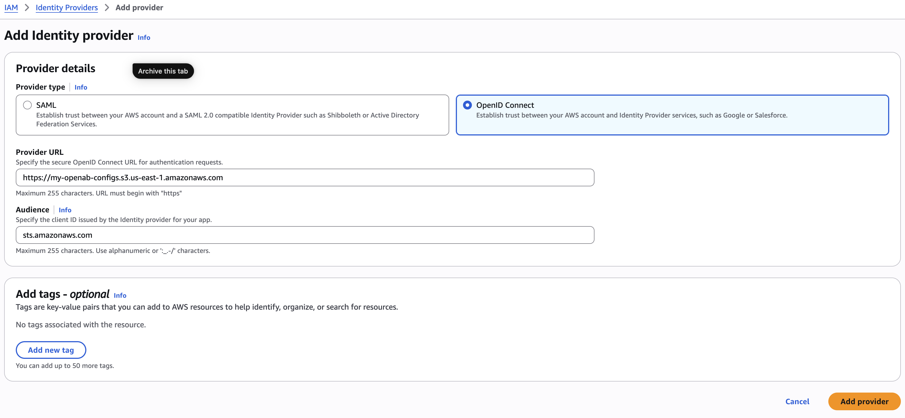
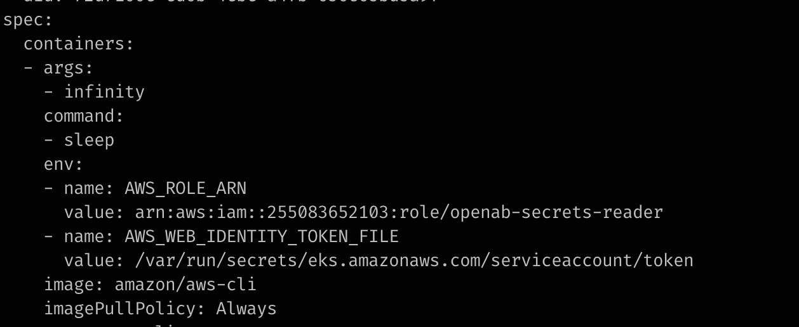

# Zeabur for OpenAB

## Prerequisite

SSH authorization key
copy your id_rsa.pub content to .ssh/authorized_keys

## K3s, Kubectl
The default cluster config of k3s is in `/etc/rancher/k3s/k3s.yaml`, however it's permission is `root`. We need to copy it to kubectl default config location.
The `kubectl` in zeabur OS default config is `/etc/rancher/k3s/k3s.yaml`, we need to change it too.

Update `.bashrc`

```bash
export KUBECONFIG=/home/ubuntu/.kube/config
```

Copy `k3s.yaml`

```bash
mkdir .kube
sudo cp /etc/rancher/k3s/k3s.yaml ~/.kube/config
sudo chown ubuntu:ubuntu ~/.kube/config
```


## Prepare Helm Chart

Install `helm` command.

From Apt (Debian/Ubuntu)
Members of the Helm community have contributed an Apt package for Debian/Ubuntu. This package is generally up to date. Thanks to Buildkite for hosting the repo.

```bash
HELM_BUILDKITE_APT_KEY_ID="DDF78C3E6EBB2D2CC223C95C62BA89D07698DBC6"

sudo apt-get install curl gpg apt-transport-https --yes

curl -fsSL https://packages.buildkite.com/helm-linux/helm-debian/gpgkey > "${TMPDIR:-/tmp}/helm.gpg"

# Ensure that the key ID matches to prevent a repository compromise from establishing an attacker controlled key
if [ "$(gpg --show-keys --with-colons "${TMPDIR:-/tmp}/helm.gpg" | awk -F: '$1 == "fpr" {print $10}' | head -n 1)" != "${HELM_BUILDKITE_APT_KEY_ID}" ]; then echo "ERROR: Unexpected Helm APT key ID: potential key compromise"; exit 1; fi

cat "${TMPDIR:-/tmp}/helm.gpg" | gpg --dearmor | sudo tee /usr/share/keyrings/helm.gpg > /dev/null
echo "deb [signed-by=/usr/share/keyrings/helm.gpg] https://packages.buildkite.com/helm-linux/helm-debian/any/ any main" | sudo tee /etc/apt/sources.list.d/helm-stable-debian.list

sudo apt-get update
sudo apt-get install helm
```

在 Helm 中，正確的指令是 helm repo add（而不是單獨的 helm add），用於新增一個 Chart 軟體倉庫。

基本語法

```bash
helm repo add [NAME] [URL] [flags]
```

Add helm repo naming `openab` 

```bash
helm repo add openab https://openabdev.github.io/openab
helm repo update
```


Command line installer - All users

Command line - Current user
If you have sudo permissions, you can install the AWS CLI for all users on the computer. We provide the steps in one easy to copy and paste group. See the descriptions of each line in the following steps.

```bash
$ curl "https://awscli.amazonaws.com/AWSCLIV2.pkg" -o "AWSCLIV2.pkg"
$ sudo installer -pkg AWSCLIV2.pkg -target /
```

### aws login 

No AWS region has been configured. The AWS region is the geographic location of your AWS resources.

If you have used AWS before and already have resources in your account, specify which region they were created in. If you have not created resources in your account before, you can pick the region closest to you: https://docs.aws.amazon.com/global-infrastructure/latest/regions/aws-regions.html.

You are able to change the region in the CLI at any time with the command "aws configure set region NEW_REGION".

Attempting to open your default browser. If the browser does not open, open the following URL.
If you are unable to open the URL on this device, run this command again with the '--remote' option.

Create S3 Bucket

```bash
export S3_BUCKET_NAME=my-openab-configs
export AWS_REGION=us-east-1

aws s3api create-bucket --bucket $S3_BUCKET_NAME --region $AWS_REGION

{
    "Location": "/my-openab-configs",
    "BucketArn": "arn:aws:s3:::my-openab-configs"
}
```

先建立 openid-configuration 檔案：

```bash
cat > discovery.json <<EOF
{
    "issuer": "https://${S3_BUCKET_NAME}.s3.${AWS_REGION}.amazonaws.com",
    "jwks_uri": "https://${S3_BUCKET_NAME}.s3.${AWS_REGION}/.well-known/keys.json",
    "authorization_endpoint": "urn:kubernetes:programmatic_authorization",
    "response_types_supported": [
        "id_token"
    ],
    "subject_types_supported": [
        "public"
    ],
    "id_token_signing_alg_values_supported": [
        "RS256"
    ],
    "claims_supported": [
        "sub",
        "iss"
    ]
}
EOF
```

Upload to S3 Bucket

```bash
aws s3 cp ./discovery.json s3://$S3_BUCKET_NAME/.well-known/openid-configuration --acl public-read
```

Generate service account singing key

```bash
export PRIV_KEY="sa-signer.key"
export PUB_KEY="sa-signer.key.pub"
export PKCS_KEY="sa-signer-pkcs8.pub"

# Generate a key pair
$ ssh-keygen -t rsa -b 2048 -f $PRIV_KEY -m pem

# change file permissions
$ chmod 0600 $PRIV_KEY $PUB_KEY

# convert the generated SSH pubkey to PKCS8
$ ssh-keygen -e -m PKCS8 -f $PUB_KEY > $PKCS_KEY

$ ls -l
-rw-r--r--   1 pavan  staff Aug  7 14:52 sa-signer-pkcs8.pub
-rw-------   1 pavan  staff Aug  7 14:52 sa-signer.key
-rw-r--r--   1 pavan  staff Aug  7 14:52 sa-signer.key.pub
```

### Update K3s configuration and get jwks keys file

6. Store the newly generated service account signing keys on the K3s servers nodes and update the K3s API Server launch flags with below additional kube-api-server flags and start the K3s server

Copy those keys and update `/etc/rancher/k3s/config.yaml` in your k3s host. The description of those config.

```bash
# The below api-audiences flag sets an aud value for tokens that do not request an audience
"--kube-apiserver-arg=api-audiences=sts.amazonaws.com",
#
# This flag can be specified for multiple times.
# There is likely already one specified for legacy service accounts, if not, 
# it is using the default value. Find out your default value and pass it explicitly
# (along with this $PKCS_KEY), otherwise your existing tokens will fail.

"--kube-apiserver-arg=service-account-key-file=/etc/rancher/k3s/tls/sa-signer-pkcs8.pub",    # K3S_SA_SIGNER_PKCS8_PUB_KEY. path to the newly generated public pkcs#8 key
"--kube-apiserver-arg=service-account-key-file=/var/lib/rancher/k3s/server/tls/service.key", # generated by k3s, previously existing signing key
#
# specifies the path to a file that contains the new private key of the service account token issuer. The issuer signs issued ID tokens with this new private key.
"--kube-apiserver-arg=service-account-signing-key-file=/etc/rancher/k3s/tls/sa-signer.key",  # K3S_SA_SIGNER_PRIV_KEY newly generated signing key used for signing IRSA
#
# This flag can be specified for multiple times.
# this can be useful to enable a non-disruptive change of the issuer. When this flag is specified multiple times, the first is used to generate tokens and all are used to determine which issuers are accepted. 
"--kube-apiserver-arg=service-account-issuer=https://s3.ap-southeast-3.amazonaws.com/my-oidc-bucket",
"--kube-apiserver-arg=service-account-issuer=k3s", # enable a non-disruptive change of the issuer, trust existing SA issued by k3s
```


```bash
cat <<EOF
kube-apiserver-arg:
    - api-audiences=sts.amazonaws.com
    - service-account-key-file=/etc/rancher/k3s/tls/sa-signer-pkcs8.pub
    - service-account-key-file=/var/lib/rancher/k3s/server/tls/service.key
    - service-account-signing-key-file=/etc/rancher/k3s/tls/sa-signer.key
    - service-account-issuer=https://${S3_BUCKET_NAME}.s3.${AWS_REGION}.amazonaws.com
    - service-account-issuer=k3s
EOF
```

Use this output to append to your `/etc/rancher/k3s/config.yaml`. Restart the K3s service on each server node so the new flags take effect:bash

```bash
sudo systemctl restart k3s
```

7. Upload the JWKS keys.json file to the same S3 bucket where we will publish the public keys that clients can use to Verify the signature of client-based access tokens and OpenID Connect ID tokens

```bash
kubectl get --raw /openid/v1/jwks | jq > ./keys.json

aws s3 cp ./keys.json s3://$S3_BUCKET_NAME/.well-known/keys.json --acl public-read

{
    "UserId": "255083652103",
    "Account": "255083652103",
    "Arn": "arn:aws:iam::255083652103:root"
}
```

8. Create an OIDC provider for your cluster. Set the Provider URL to `https://${S3_BUCKET_NAME}.s3.${AWS_REGION}.amazonaws.com` and Audience to `sts.amazonaws.com`

Go to IAM -> Identity Providers -> Create Provider



### Install AWS pod mutating admission controller —

10. Deploy Cert Manager as its a pre-requisite for the pod mutating admission controller https://cert-manager.io/docs/installation/

```bash
kubectl apply -f https://github.com/cert-manager/cert-manager/releases/download/v1.15.2/cert-manager.yaml
```

11. Deploy Amazon EKS Pod Identity Webhook

https://github.com/aws/amazon-eks-pod-identity-webhook/tree/master

A mutating admission controller for automatically injecting AWS credentials to the Pods that used the Service Accounts signed using our new OIDC Issuer

# clone the git repository and run

```bash
git clone https://github.com/aws/amazon-eks-pod-identity-webhook && cd amazon-eks-pod-identity-webhook
make cluster-up IMAGE=amazon/amazon-eks-pod-identity-webhook:latest

kubectl get pod -n default

NAME                                    READY   STATUS    RESTARTS   AGE
pod-identity-webhook-7c9b84776d-b9zq2   1/1     Running   0          17s
```

## 建立 IRSA in AWS

Assuming:

```bash
export NAMESPACE=guandu
export SERVICE_ACCOUNT=openab
export AWS_ACCOUNT_ID=255083652103
export ROLE_NAME=openab-secrets-reader
export ROLE_ARN="arn:aws:iam::${AWS_ACCOUNT_ID}:role/${ROLE_NAME}"
export OIDC_HOSTPATH="${S3_BUCKET_NAME}.s3.${AWS_REGION}.amazonaws.com"
```

你這裡需要建立的是兩個不同東西：

IAM Role + Trust Policy：決定哪個 k3s ServiceAccount 可以透過 OIDC assume 這個 role。
Permissions Policy：就是你貼的 S3 + Secrets Manager 權限，決定 assume 成功後可以做什麼。

AWS CLI 建立 Role 時，trust policy 要透過 --assume-role-policy-document 提供；之後再用 put-role-policy 或 managed policy attach 給 role。

假設你目前的環境是：

先建立 trust policy 檔案：

```bash
cat > trust-policy.json <<EOF
{
  "Version": "2012-10-17",
  "Statement": [
    {
      "Effect": "Allow",
      "Principal": {
        "Federated": "arn:aws:iam::${AWS_ACCOUNT_ID}:oidc-provider/${OIDC_HOSTPATH}"
      },
      "Action": "sts:AssumeRoleWithWebIdentity",
      "Condition": {
        "StringEquals": {
          "${OIDC_HOSTPATH}:sub": "system:serviceaccount:${NAMESPACE}:${SERVICE_ACCOUNT}"
        }
      }
    }
  ]
}
EOF
```

接著建立 IAM Role：

```bash
aws iam create-role \
  --role-name $ROLE_NAME \
  --assume-role-policy-document file://trust-policy.json
```

或是修改

```bash
aws iam update-assume-role-policy \
  --role-name $ROLE_NAME \
  --policy-document file://trust-policy.json
```


這一步會建立：

```bash
IAM Role:
openab-secrets-reader

Trust:
k3s OIDC Provider
    |
    +-- namespace: guandu
    |
    +-- service account:
        openab-secrets-reader
```

AWS CLI 官方的 create-role 就是用這種方式建立 role 並同時指定 trust relationship。

接下來建立 permissions policy：

```bash
cat > permissions-policy.json <<EOF
{
  "Version": "2012-10-17",
  "Statement": [
    {
      "Effect": "Allow",
      "Action": [
        "s3:GetObject",
        "s3:ListBucket"
      ],
      "Resource": "arn:aws:s3:::${S3_BUCKET_NAME}/agents/*"
    },
    {
      "Effect": "Allow",
      "Action": [
        "secretsmanager:GetSecretValue"
      ],
      "Resource": "arn:aws:secretsmanager:*:*:secret:openab/*"
    }
  ]
}
EOF
```

然後最簡單的做法，是直接加成 inline policy：

```bash
aws iam put-role-policy \
  --role-name ${ROLE_NAME} \
  --policy-name openab-secrets-reader-policy \
  --policy-document file://permissions-policy.json
```

put-role-policy 會把 policy 直接嵌在這個 Role 裡，適合這種「這個 policy 就只屬於這個 IRSA role」的情境。

完成後，你的 AWS IAM 結構會是：

```bash
IAM Role
└── openab-secrets-reader
    │
    ├── Trust policy
    │   └── OIDC Provider
    │       └── system:serviceaccount:
    │           guandu:openab-secrets-reader
    │
    └── Inline permissions policy
        └── openab-secrets-reader-policy
            ├── s3:GetObject
            │   └── my-openab-configs/agents/*
            │
            └── secretsmanager:GetSecretValue
                └── openab/*
```

然後 Kubernetes 這邊：

```bash
kubectl create namespace $NAMESPACE

kubectl create serviceaccount \
  $SERVICE_ACCOUNT \
  -n $NAMESPACE
```

取得剛建立的 IAM Role ARN：

```bash
ROLE_ARN=$(aws iam get-role \
  --role-name openab-secrets-reader \
  --query 'Role.Arn' \
  --output text)

echo "$ROLE_ARN"
```

應該會得到：

```bash
arn:aws:iam::255083652103:role/openab-secrets-reader
```

然後把它 annotate 到 ServiceAccount：

```bash
kubectl annotate serviceaccount \
  $SERVICE_ACCOUNT \
  -n $NAMESPACE \
  eks.amazonaws.com/role-arn="${ROLE_ARN}"
```

驗證：

```bash
kubectl get sa $SERVICE_ACCOUNT \
  -n $NAMESPACE \
  -o yaml
```

你應該看到：

```bash
apiVersion: v1
kind: ServiceAccount
metadata:
  name: openab-secrets-reader
  namespace: guandu
  annotations:
    eks.amazonaws.com/role-arn: arn:aws:iam::255083652103:role/openab-secrets-reader
```

最後建議也驗證 AWS IAM 端。

看 Role：

```bash
aws iam get-role \
  --role-name openab-secrets-reader
```

看 inline policy：

```bash
aws iam list-role-policies \
  --role-name openab-secrets-reader
```

應該看到：

```bash
{
  "PolicyNames": [
    "openab-secrets-reader-policy"
  ]
}
```

再看內容：

```bash
aws iam get-role-policy \
  --role-name openab-secrets-reader \
  --policy-name openab-secrets-reader-policy
```

***有一個地方你一定要確認：你的 OIDC_HOSTPATH 必須跟 AWS IAM OIDC Provider 裡實際建立的 URL 完全一致，而且 k3s JWT 的 iss 也要對得上。否則 role 和 policy 都建立成功，最後 STS 還是會報 InvalidIdentityToken 或 AccessDenied。***

### 建立一個 pod 驗證

Create a deployment in `guandu` namespace and edit the deployment to add the `serviceAccountName: guandu`

```bash
kubectl -n $NAMESPACE create deploy aws-cli --image amazon/aws-cli

kubectl -n $NAMESPACE edit deployment.apps/aws-cli
# add serviceAccountName
# also add sleep command to run the pod forever

```yaml
spec:
  template:
    spec:
      containers:
      - args:
        - infinity
        command:
        - sleep
        image: amazon/aws-cli
      serviceAccountName: openab
```

```bash
kubectl -n $NAMESPACE rollout restart deployment <deployment-name> 
kubectl -n $NAMESPACE get po aws-cli-xxddee -o yaml
```

Now the AWS Credentials should be automatically injected to the awscli deployment pods by the AWS Pod Mutating Admission Controller

kubectl -n $NAMESPACE pods/aws-cli-xxxxxxxx-xxxxx -oyaml




kubectl exec -n guandu -it deployment/aws-cli -- bash


aws s3api get-object --bucket my-openab-configs --key agents/config-caocao.toml config-caocao.toml
aws s3 cp s3://my-openab-configs/agents/config-caocao.toml ./config-caocao.toml


Create the ServiceAccount:

```bash
kubectl create serviceaccount ${SERVICE_ACCOUNT} \
  --namespace ${NAMESPACE}
```

Annotate it with the IAM role:

```bash
kubectl annotate serviceaccount ${SERVICE_ACCOUNT} \
  --namespace ${NAMESPACE} \
  eks.amazonaws.com/role-arn="${ROLE_ARN}"
```

That command corresponds to:

```bash
apiVersion: v1
kind: ServiceAccount
metadata:
  name: openab
  namespace: guandu
  annotations:
    eks.amazonaws.com/role-arn: arn:aws:iam::255083652103:role/openab-secrets-reader
```
AWS uses exactly this annotation for IRSA.


aws secretsmanager create-secret \
    --name openab/prod \
    --secret-string file://aws-sm-secrets.json

{
    "ARN": "arn:aws:secretsmanager:us-east-1:255083652103:secret:openab/prod-PHnaot",
    "Name": "openab/prod",
    "VersionId": "caf33b83-53d4-49df-9db8-8af0f5382723"
}

aws secretsmanager get-secret-value \
    --secret-id openab/prod
